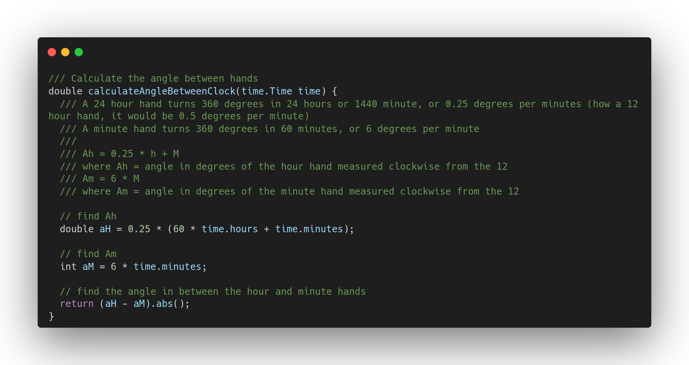
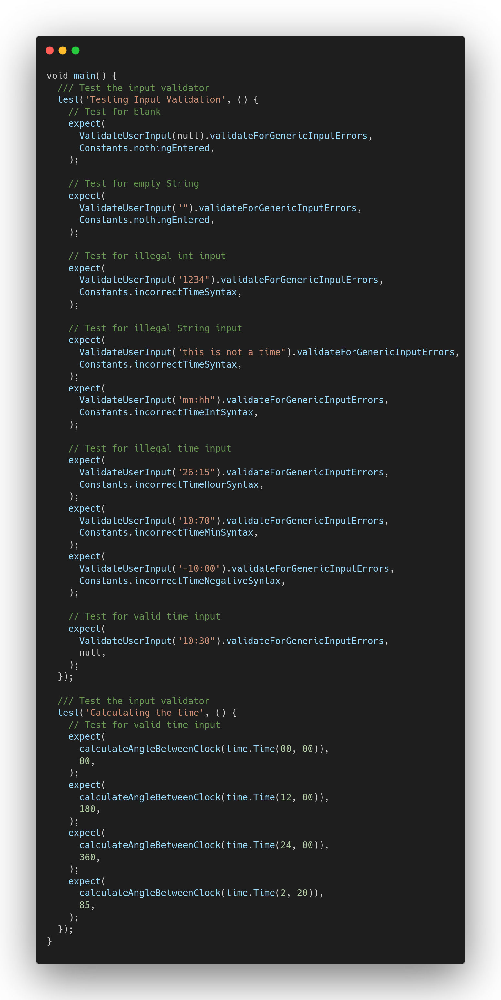

## A command line program for calculating angle between 2 hands for a 24 hour clock written in Dart

To run the program, run:
dart bin/clock_angle_calculator.dart

Main file: bin/clock_angle_calculator
Helper methods: lib/
Unit tests: test/clock_angle_calculator_test.dart

Logic:

Unit Tests:
